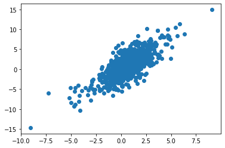

## What it does:

This packages receives a data frame and function that could have multiplicative terms and runs setpwise selection from this package.

https://github.com/talhahascelik/python_stepwiseSelection

## Install package


```python
%%capture
!pip3 install git+git://github.com/gabriela-plantie/stepwise_formula
```


```python
from stepwise_formula.stepwise import stepwise
```


```python
import pandas as pd
import numpy as np
import scipy as sc
from matplotlib import pyplot as plt
import statsmodels.formula.api as smf
import statsmodels.api as sm
```

## create table with simulated data


```python
x1=np.random.normal(0,1,1000)
x2=np.random.normal(0,1,1000)
x3=np.random.normal(0,1,1000)
x4=np.random.normal(0,1,1000)/5

z=1 + 2*x1 + 3*x2 + 2*x2*x3 + x4
pr=1/(1+np.exp(-z))
y=sc.stats.binom.rvs(1, pr, size=1000)
df = pd.DataFrame(data={'y':y, 'x1':x1, 'x2':x2, 'x3':x3, 'x4':x4})

```

## Define formula


```python
formula = 'y ~ x1 + x2*x3*x4'
```

## Run stepwise using formula


```python
a = stepwise(formula, df, 'logistic')
```

    Character Variables (Dummies Generated, First Dummies Dropped): []
    Optimization terminated successfully.
             Current function value: 0.292915
             Iterations 8
    Eliminated : x3
    Optimization terminated successfully.
             Current function value: 0.292943
             Iterations 8
    Eliminated : x2*x4
    Optimization terminated successfully.
             Current function value: 0.293177
             Iterations 8
    Eliminated : x3*x4
    Optimization terminated successfully.
             Current function value: 0.293655
             Iterations 8
    Eliminated : x2*x3*x4
    Optimization terminated successfully.
             Current function value: 0.294603
             Iterations 8
                               Logit Regression Results                           
    ==============================================================================
    Dep. Variable:                      y   No. Observations:                 1000
    Model:                          Logit   Df Residuals:                      995
    Method:                           MLE   Df Model:                            4
    Date:                Mon, 05 Oct 2020   Pseudo R-squ.:                  0.5609
    Time:                        15:54:56   Log-Likelihood:                -294.60
    converged:                       True   LL-Null:                       -670.93
    Covariance Type:            nonrobust   LLR p-value:                1.377e-161
    ==============================================================================
                     coef    std err          z      P>|z|      [0.025      0.975]
    ------------------------------------------------------------------------------
    intercept      1.1250      0.121      9.327      0.000       0.889       1.361
    x1             2.1661      0.171     12.636      0.000       1.830       2.502
    x2             3.3304      0.247     13.479      0.000       2.846       3.815
    x4             1.2785      0.526      2.431      0.015       0.248       2.309
    x2*x3          2.1017      0.204     10.323      0.000       1.703       2.501
    ==============================================================================
    AIC: 599.2050648684576
    BIC: 623.7438412633683
    Final Variables: ['intercept', 'x1', 'x2', 'x4', 'x2*x3']


## filter final list of variables by pvalue


```python
np.round(a[2].params[a[2].pvalues<0.01],2)
```


    intercept    1.12
    x1           2.17
    x2           3.33
    x2*x3        2.10
    dtype: float64


## generate model with resulting varibles


```python
formula = 'y ~ x1 + x2 + x2:x3'
model = smf.glm(formula = formula, data=df, family=sm.families.Binomial())
mod = model.fit()
```


```python
np.round(mod.params[mod.pvalues<0.01],2)
```


    Intercept    1.09
    x1           2.12
    x2           3.27
    x2:x3        2.07
    dtype: float64


```python
pred=mod.predict(df)
```


```python
plt.scatter(pr, pred)
```


    <matplotlib.collections.PathCollection at 0x7f4c23d573d0>


    

    


```python

```


```python
#jupyter nbconvert README.ipynb --to markdown
```


```python

```
