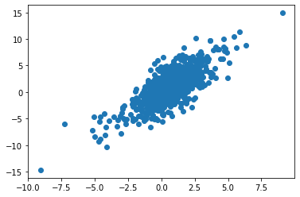

## What it does:

This packages receives a data frame and function that could have multiplicative terms and runs setpwise selection from this package.

https://github.com/talhahascelik/python_stepwiseSelection

## Install package


```python
%%capture
!pip3 install git+git://github.com/gabriela-plantie/stepwise_formula
```


```python
from stepwise_formula.stepwise import stepwise
```
# de las carpetas
from stepwise_formula.stepwiseSelector import backwardSelection
from stepwise_formula.formula import Formula
from stepwise_formula.stepwise import stepwise

```python
import pandas as pd
import numpy as np
import scipy as sc
from matplotlib import pyplot as plt
import statsmodels.formula.api as smf
import statsmodels.api as sm
import random
```

## create table with simulated data


```python

def create_df(seed):
    np.random.seed(seed)
    x1=np.random.normal(0,1,1000)
    x2=np.random.normal(0,1,1000)
    x3=np.random.normal(0,1,1000)
    x4=np.random.normal(0,1,1000)/5

    z=1 + 2*x1 + x2 + 2*x2*x3 +x4
    pr=1/(1+np.exp(-z))
    y=sc.stats.binom.rvs(1, pr, size=1000)
    y1= z+x4
    df = pd.DataFrame(data={'y':y, 'y1': y1,'x1':x1, 'x2':x2, 'x3':x3, 'x4':x4})
    return [df,z]
```


```python
df= create_df(30)[0]
z= create_df(30)[1]
```

## Define formula


```python
formula = 'y ~  x2*x3 + x1:x4 '
```

## Run stepwise using formula


```python
mod = stepwise(formula, df, 'logistic')
```

    {x1*x4, 'x2', x2*x3, 'x3'}
    Character Variables (Dummies Generated, First Dummies Dropped): []
    Optimization terminated successfully.
             Current function value: 0.541247
             Iterations 6
    Eliminated : x3
    Optimization terminated successfully.
             Current function value: 0.541255
             Iterations 6
                               Logit Regression Results                           
    ==============================================================================
    Dep. Variable:                      y   No. Observations:                 1000
    Model:                          Logit   Df Residuals:                      996
    Method:                           MLE   Df Model:                            3
    Date:                Fri, 23 Oct 2020   Pseudo R-squ.:                  0.1806
    Time:                        13:36:53   Log-Likelihood:                -541.26
    converged:                       True   LL-Null:                       -660.53
    Covariance Type:            nonrobust   LLR p-value:                 1.954e-51
    ==============================================================================
                     coef    std err          z      P>|z|      [0.025      0.975]
    ------------------------------------------------------------------------------
    intercept      0.6208      0.075      8.286      0.000       0.474       0.768
    x1*x4          1.3253      0.371      3.574      0.000       0.599       2.052
    x2             0.6711      0.093      7.240      0.000       0.489       0.853
    x2*x3          1.3555      0.122     11.097      0.000       1.116       1.595
    ==============================================================================
    AIC: 1090.51050046908
    BIC: 1110.1415215850084
    Final Variables: ['intercept', 'x1*x4', 'x2', 'x2*x3']


```python
mod.model_type
```


    'logistic'


```python
mod.model
```


    <statsmodels.discrete.discrete_model.BinaryResultsWrapper at 0x7f376c79cac0>


## Predicction on another dataset


```python
testResults= mod.predict(df, alpha=0.05)
```


```python
testResults
```


    <stepwise_formula.stepwise.TestResults at 0x7f3726470190>


```python
t=testResults.testDataframe
```


```python
t['pred'] = testResults.prediction
```


```python
t
```


<div>

<table border="1" class="dataframe">
  <thead>
    <tr style="text-align: right;">
      <th></th>
      <th>intercept</th>
      <th>x1*x4</th>
      <th>x2</th>
      <th>x2*x3</th>
      <th>pred</th>
    </tr>
  </thead>
  <tbody>
    <tr>
      <th>0</th>
      <td>1</td>
      <td>-0.142610</td>
      <td>0.452175</td>
      <td>0.139584</td>
      <td>0.715952</td>
    </tr>
    <tr>
      <th>1</th>
      <td>1</td>
      <td>-0.016467</td>
      <td>1.134899</td>
      <td>-0.830760</td>
      <td>0.558363</td>
    </tr>
    <tr>
      <th>2</th>
      <td>1</td>
      <td>-0.178077</td>
      <td>0.077442</td>
      <td>-0.046015</td>
      <td>0.592518</td>
    </tr>
    <tr>
      <th>3</th>
      <td>1</td>
      <td>0.098642</td>
      <td>0.226821</td>
      <td>-0.494669</td>
      <td>0.558039</td>
    </tr>
    <tr>
      <th>4</th>
      <td>1</td>
      <td>-0.051086</td>
      <td>0.526648</td>
      <td>0.189129</td>
      <td>0.761861</td>
    </tr>
    <tr>
      <th>...</th>
      <td>...</td>
      <td>...</td>
      <td>...</td>
      <td>...</td>
      <td>...</td>
    </tr>
    <tr>
      <th>995</th>
      <td>1</td>
      <td>-0.107829</td>
      <td>0.897219</td>
      <td>-0.164495</td>
      <td>0.702047</td>
    </tr>
    <tr>
      <th>996</th>
      <td>1</td>
      <td>-0.017205</td>
      <td>-0.577262</td>
      <td>-0.256417</td>
      <td>0.465798</td>
    </tr>
    <tr>
      <th>997</th>
      <td>1</td>
      <td>-0.002307</td>
      <td>0.904900</td>
      <td>0.125015</td>
      <td>0.801311</td>
    </tr>
    <tr>
      <th>998</th>
      <td>1</td>
      <td>-0.008264</td>
      <td>1.120783</td>
      <td>0.405615</td>
      <td>0.871228</td>
    </tr>
    <tr>
      <th>999</th>
      <td>1</td>
      <td>0.077656</td>
      <td>-0.420349</td>
      <td>-0.276153</td>
      <td>0.516808</td>
    </tr>
  </tbody>
</table>
<p>1000 rows × 5 columns</p>
</div>


## Plot model logit vs original logit


```python
plt.scatter(list(map(lambda p: np.log(p/(1-p)), t['pred'])) , z)
```


    <matplotlib.collections.PathCollection at 0x7f372395cd30>


    

    


## Linear


```python
formula = 'y1 ~  x2*x3+x4 '
```


```python
mod = stepwise(formula, df, 'linear')
```

    {'x4', 'x2', x2*x3, 'x3'}
    Character Variables (Dummies Generated, First Dummies Dropped): []
    Eliminated : x3
    Regained :  x3
                                OLS Regression Results                            
    ==============================================================================
    Dep. Variable:                     y1   R-squared:                       0.555
    Model:                            OLS   Adj. R-squared:                  0.553
    Method:                 Least Squares   F-statistic:                     310.3
    Date:                Fri, 23 Oct 2020   Prob (F-statistic):          3.02e-173
    Time:                        13:37:01   Log-Likelihood:                -2091.6
    No. Observations:                1000   AIC:                             4193.
    Df Residuals:                     995   BIC:                             4218.
    Df Model:                           4                                         
    Covariance Type:            nonrobust                                         
    ==============================================================================
                     coef    std err          t      P>|t|      [0.025      0.975]
    ------------------------------------------------------------------------------
    intercept      1.0326      0.062     16.589      0.000       0.910       1.155
    x4             2.4669      0.304      8.115      0.000       1.870       3.063
    x2             1.0031      0.064     15.637      0.000       0.877       1.129
    x2*x3          2.0311      0.063     32.149      0.000       1.907       2.155
    x3            -0.0916      0.061     -1.489      0.137      -0.212       0.029
    ==============================================================================
    Omnibus:                        0.767   Durbin-Watson:                   2.033
    Prob(Omnibus):                  0.682   Jarque-Bera (JB):                0.758
    Skew:                           0.067   Prob(JB):                        0.684
    Kurtosis:                       2.991   Cond. No.                         5.06
    ==============================================================================
    
    Notes:
    [1] Standard Errors assume that the covariance matrix of the errors is correctly specified.
    AIC: 4193.255995938327
    BIC: 4217.794772333238
    Final Variables: ['intercept', 'x4', 'x2', 'x2*x3', 'x3']


```python
testResults= mod.predict(df, alpha=0.05)
```


```python
testResults.testDataframe
```


<div>

<table border="1" class="dataframe">
  <thead>
    <tr style="text-align: right;">
      <th></th>
      <th>intercept</th>
      <th>x4</th>
      <th>x2</th>
      <th>x2*x3</th>
      <th>x3</th>
    </tr>
  </thead>
  <tbody>
    <tr>
      <th>0</th>
      <td>1</td>
      <td>0.112820</td>
      <td>0.452175</td>
      <td>0.139584</td>
      <td>0.308695</td>
    </tr>
    <tr>
      <th>1</th>
      <td>1</td>
      <td>-0.010777</td>
      <td>1.134899</td>
      <td>-0.830760</td>
      <td>-0.732013</td>
    </tr>
    <tr>
      <th>2</th>
      <td>1</td>
      <td>0.183450</td>
      <td>0.077442</td>
      <td>-0.046015</td>
      <td>-0.594185</td>
    </tr>
    <tr>
      <th>3</th>
      <td>1</td>
      <td>0.209627</td>
      <td>0.226821</td>
      <td>-0.494669</td>
      <td>-2.180876</td>
    </tr>
    <tr>
      <th>4</th>
      <td>1</td>
      <td>0.507330</td>
      <td>0.526648</td>
      <td>0.189129</td>
      <td>0.359118</td>
    </tr>
    <tr>
      <th>...</th>
      <td>...</td>
      <td>...</td>
      <td>...</td>
      <td>...</td>
      <td>...</td>
    </tr>
    <tr>
      <th>995</th>
      <td>1</td>
      <td>-0.128762</td>
      <td>0.897219</td>
      <td>-0.164495</td>
      <td>-0.183339</td>
    </tr>
    <tr>
      <th>996</th>
      <td>1</td>
      <td>-0.064541</td>
      <td>-0.577262</td>
      <td>-0.256417</td>
      <td>0.444195</td>
    </tr>
    <tr>
      <th>997</th>
      <td>1</td>
      <td>-0.005238</td>
      <td>0.904900</td>
      <td>0.125015</td>
      <td>0.138153</td>
    </tr>
    <tr>
      <th>998</th>
      <td>1</td>
      <td>-0.056286</td>
      <td>1.120783</td>
      <td>0.405615</td>
      <td>0.361903</td>
    </tr>
    <tr>
      <th>999</th>
      <td>1</td>
      <td>-0.225817</td>
      <td>-0.420349</td>
      <td>-0.276153</td>
      <td>0.656963</td>
    </tr>
  </tbody>
</table>
<p>1000 rows × 5 columns</p>
</div>


```python
testResults.prediction
```


    0      2.019718
    1      0.524111
    2      1.523769
    3      0.972228
    4      3.163633
             ...   
    995    1.297642
    996   -0.267152
    997    2.168642
    998    2.808699
    999   -0.567166
    Name: mean, Length: 1000, dtype: float64


```python
testResults.intervals
```


<div>
<table border="1" class="dataframe">
  <thead>
    <tr style="text-align: right;">
      <th></th>
      <th>mean</th>
      <th>mean_se</th>
      <th>mean_ci_lower</th>
      <th>mean_ci_upper</th>
      <th>obs_ci_lower</th>
      <th>obs_ci_upper</th>
    </tr>
  </thead>
  <tbody>
    <tr>
      <th>0</th>
      <td>2.019718</td>
      <td>0.078220</td>
      <td>1.866224</td>
      <td>2.173213</td>
      <td>-1.838213</td>
      <td>5.877650</td>
    </tr>
    <tr>
      <th>1</th>
      <td>0.524111</td>
      <td>0.114424</td>
      <td>0.299570</td>
      <td>0.748652</td>
      <td>-3.337300</td>
      <td>4.385522</td>
    </tr>
    <tr>
      <th>2</th>
      <td>1.523769</td>
      <td>0.089071</td>
      <td>1.348980</td>
      <td>1.698557</td>
      <td>-2.335069</td>
      <td>5.382606</td>
    </tr>
    <tr>
      <th>3</th>
      <td>0.972228</td>
      <td>0.161526</td>
      <td>0.655258</td>
      <td>1.289198</td>
      <td>-2.895658</td>
      <td>4.840114</td>
    </tr>
    <tr>
      <th>4</th>
      <td>3.163633</td>
      <td>0.169810</td>
      <td>2.830406</td>
      <td>3.496860</td>
      <td>-0.705619</td>
      <td>7.032886</td>
    </tr>
    <tr>
      <th>...</th>
      <td>...</td>
      <td>...</td>
      <td>...</td>
      <td>...</td>
      <td>...</td>
      <td>...</td>
    </tr>
    <tr>
      <th>995</th>
      <td>1.297642</td>
      <td>0.094512</td>
      <td>1.112177</td>
      <td>1.483108</td>
      <td>-2.561693</td>
      <td>5.156978</td>
    </tr>
    <tr>
      <th>996</th>
      <td>-0.267152</td>
      <td>0.083674</td>
      <td>-0.431349</td>
      <td>-0.102954</td>
      <td>-4.125524</td>
      <td>3.591220</td>
    </tr>
    <tr>
      <th>997</th>
      <td>2.168642</td>
      <td>0.085525</td>
      <td>2.000813</td>
      <td>2.336472</td>
      <td>-1.689886</td>
      <td>6.027170</td>
    </tr>
    <tr>
      <th>998</th>
      <td>2.808699</td>
      <td>0.102713</td>
      <td>2.607141</td>
      <td>3.010258</td>
      <td>-1.051443</td>
      <td>6.668842</td>
    </tr>
    <tr>
      <th>999</th>
      <td>-0.567166</td>
      <td>0.109571</td>
      <td>-0.782183</td>
      <td>-0.352149</td>
      <td>-4.428035</td>
      <td>3.293702</td>
    </tr>
  </tbody>
</table>
<p>1000 rows × 6 columns</p>
</div>


```python
#jupyter nbconvert README.ipynb --to markdown
```
