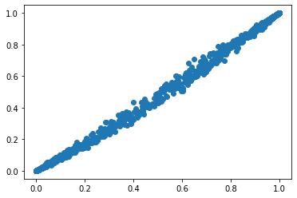

```python
#jupyter nbconvert README.ipynb --to markdown
```

## Install package


```python
!pip3 install git+git://github.com/gabriela-plantie/stepwise_formula
```

    Collecting git+git://github.com/gabriela-plantie/stepwise_formula
      Cloning git://github.com/gabriela-plantie/stepwise_formula to /tmp/pip-req-build-erk__6k6
      Running command git clone -q git://github.com/gabriela-plantie/stepwise_formula /tmp/pip-req-build-erk__6k6
    Requirement already satisfied (use --upgrade to upgrade): stepwise-formula==0.0.1 from git+git://github.com/gabriela-plantie/stepwise_formula in /home/gaby/.local/lib/python3.8/site-packages
    Requirement already satisfied: numpy>=1.19.2 in /home/gaby/.local/lib/python3.8/site-packages (from stepwise-formula==0.0.1) (1.19.2)
    Requirement already satisfied: pandas>=1.1.2 in /home/gaby/.local/lib/python3.8/site-packages (from stepwise-formula==0.0.1) (1.1.2)
    Requirement already satisfied: statsmodels>=0.12.0 in /home/gaby/.local/lib/python3.8/site-packages (from stepwise-formula==0.0.1) (0.12.0)
    Requirement already satisfied: pytz>=2017.2 in /home/gaby/.local/lib/python3.8/site-packages (from pandas>=1.1.2->stepwise-formula==0.0.1) (2020.1)
    Requirement already satisfied: python-dateutil>=2.7.3 in /home/gaby/.local/lib/python3.8/site-packages (from pandas>=1.1.2->stepwise-formula==0.0.1) (2.8.1)
    Requirement already satisfied: scipy>=1.1 in /home/gaby/.local/lib/python3.8/site-packages (from statsmodels>=0.12.0->stepwise-formula==0.0.1) (1.5.2)
    Requirement already satisfied: patsy>=0.5 in /home/gaby/.local/lib/python3.8/site-packages (from statsmodels>=0.12.0->stepwise-formula==0.0.1) (0.5.1)
    Requirement already satisfied: six>=1.5 in /usr/lib/python3/dist-packages (from python-dateutil>=2.7.3->pandas>=1.1.2->stepwise-formula==0.0.1) (1.14.0)
    Building wheels for collected packages: stepwise-formula
      Building wheel for stepwise-formula (setup.py) ... [?25ldone
    [?25h  Created wheel for stepwise-formula: filename=stepwise_formula-0.0.1-py3-none-any.whl size=8422 sha256=0f52650742cc39db820f5276094e354e4dd88c02ac6d3a248e9621e14a043294
      Stored in directory: /tmp/pip-ephem-wheel-cache-cmizbg47/wheels/18/c1/3b/ea625303e5c0fc27e4ada46d58cafe2b64cc55de8ec014afa8
    Successfully built stepwise-formula


```python
from stepwise_formula.stepwise import stepwise
```


```python
import pandas as pd
import numpy as np
import scipy as sc
from matplotlib import pyplot as plt
import statsmodels.formula.api as smf
import statsmodels.api as sm
```

## create table with simulated data


```python
x1=np.random.normal(0,1,1000)
x2=np.random.normal(0,1,1000)
x3=np.random.normal(0,1,1000)
x4=np.random.normal(0,1,1000)/5

z=1 + 2*x1 + 3*x2 + 2*x2*x3 + x4
pr=1/(1+np.exp(-z))
y=sc.stats.binom.rvs(1, pr, size=1000)
df = pd.DataFrame(data={'y':y, 'x1':x1, 'x2':x2, 'x3':x3, 'x4':x4})

```

## Define formula


```python
formula = 'y ~ x1 + x2*x3*x4'
```

## Run stepwise using formula


```python
a = stepwise(formula, df, 'logistic')
```

    Character Variables (Dummies Generated, First Dummies Dropped): []
    Optimization terminated successfully.
             Current function value: 0.292915
             Iterations 8
    Eliminated : x3
    Optimization terminated successfully.
             Current function value: 0.292943
             Iterations 8
    Eliminated : x2*x4
    Optimization terminated successfully.
             Current function value: 0.293177
             Iterations 8
    Eliminated : x3*x4
    Optimization terminated successfully.
             Current function value: 0.293655
             Iterations 8
    Eliminated : x2*x3*x4
    Optimization terminated successfully.
             Current function value: 0.294603
             Iterations 8
                               Logit Regression Results                           
    ==============================================================================
    Dep. Variable:                      y   No. Observations:                 1000
    Model:                          Logit   Df Residuals:                      995
    Method:                           MLE   Df Model:                            4
    Date:                Mon, 05 Oct 2020   Pseudo R-squ.:                  0.5609
    Time:                        15:54:56   Log-Likelihood:                -294.60
    converged:                       True   LL-Null:                       -670.93
    Covariance Type:            nonrobust   LLR p-value:                1.377e-161
    ==============================================================================
                     coef    std err          z      P>|z|      [0.025      0.975]
    ------------------------------------------------------------------------------
    intercept      1.1250      0.121      9.327      0.000       0.889       1.361
    x1             2.1661      0.171     12.636      0.000       1.830       2.502
    x2             3.3304      0.247     13.479      0.000       2.846       3.815
    x4             1.2785      0.526      2.431      0.015       0.248       2.309
    x2*x3          2.1017      0.204     10.323      0.000       1.703       2.501
    ==============================================================================
    AIC: 599.2050648684576
    BIC: 623.7438412633683
    Final Variables: ['intercept', 'x1', 'x2', 'x4', 'x2*x3']


## filter final list of variables by pvalue


```python
np.round(a[2].params[a[2].pvalues<0.01],2)
```


    intercept    1.12
    x1           2.17
    x2           3.33
    x2*x3        2.10
    dtype: float64


## generate model with resulting varibles


```python
formula = 'y ~ x1 + x2 + x2:x3'
model = smf.glm(formula = formula, data=df, family=sm.families.Binomial())
mod = model.fit()
```


```python
np.round(mod.params[mod.pvalues<0.01],2)
```


    Intercept    1.09
    x1           2.12
    x2           3.27
    x2:x3        2.07
    dtype: float64


```python
pred=mod.predict(df)
```


```python
plt.scatter(pr, pred)
```


    <matplotlib.collections.PathCollection at 0x7f4c23d573d0>


    

    


```python

```
