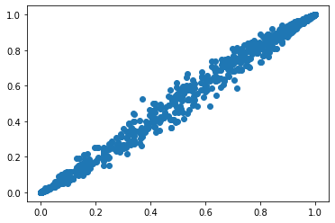

```python
#!python3 -m pip install /mnt/c/Users/AR00127255/Documents/00_git/python/stepwise_formula/
#!pip3 install nbconvert

#jupyter nbconvert --ClearMetadataPreprocessor.enabled=True --ClearOutput.enabled=True --to markdown README.ipynb
```


```python
import sys
# insert at 1, 0 is the script path (or '' in REPL)
sys.path.insert(1, '/mnt/c/Users/AR00127255/Documents/00_git/python/stepwise_formula')


```


```python
from stepwise_formula.stepwise import stepwise
```


```python
import pandas as pd
import stepwiseSelection as ss
import numpy as np
import scipy as sc
from matplotlib import pyplot as plt
import statsmodels.formula.api as smf
import statsmodels.api as sm
```

## create table with simulated data


```python
x1=np.random.normal(0,1,1000)
x2=np.random.normal(0,1,1000)
x3=np.random.normal(0,1,1000)

z=1 + 2*x1 + 3*x2 + 2*x2*x3
pr=1/(1+np.exp(-z))
y=sc.stats.binom.rvs(1, pr, size=1000)
df = pd.DataFrame(data={'y':y, 'x1':x1, 'x2':x2, 'x3':x3})

df
```


<div>
<style scoped>
    .dataframe tbody tr th:only-of-type {
        vertical-align: middle;
    }

    .dataframe tbody tr th {
        vertical-align: top;
    }

    .dataframe thead th {
        text-align: right;
    }
</style>
<table border="1" class="dataframe">
  <thead>
    <tr style="text-align: right;">
      <th></th>
      <th>y</th>
      <th>x1</th>
      <th>x2</th>
      <th>x3</th>
    </tr>
  </thead>
  <tbody>
    <tr>
      <th>0</th>
      <td>1</td>
      <td>0.400647</td>
      <td>0.912170</td>
      <td>-0.407610</td>
    </tr>
    <tr>
      <th>1</th>
      <td>0</td>
      <td>-0.381995</td>
      <td>-0.521871</td>
      <td>-0.332622</td>
    </tr>
    <tr>
      <th>2</th>
      <td>1</td>
      <td>0.808790</td>
      <td>-1.852113</td>
      <td>-1.483820</td>
    </tr>
    <tr>
      <th>3</th>
      <td>0</td>
      <td>-0.908704</td>
      <td>-0.741722</td>
      <td>0.690781</td>
    </tr>
    <tr>
      <th>4</th>
      <td>0</td>
      <td>-2.907574</td>
      <td>0.715674</td>
      <td>-0.205838</td>
    </tr>
    <tr>
      <th>...</th>
      <td>...</td>
      <td>...</td>
      <td>...</td>
      <td>...</td>
    </tr>
    <tr>
      <th>995</th>
      <td>0</td>
      <td>-1.572050</td>
      <td>0.452111</td>
      <td>-0.533114</td>
    </tr>
    <tr>
      <th>996</th>
      <td>1</td>
      <td>-0.086163</td>
      <td>1.568952</td>
      <td>-0.210293</td>
    </tr>
    <tr>
      <th>997</th>
      <td>1</td>
      <td>-0.084428</td>
      <td>-0.006555</td>
      <td>0.177014</td>
    </tr>
    <tr>
      <th>998</th>
      <td>0</td>
      <td>0.549745</td>
      <td>-1.952399</td>
      <td>0.222176</td>
    </tr>
    <tr>
      <th>999</th>
      <td>1</td>
      <td>-0.023178</td>
      <td>-0.205812</td>
      <td>-1.429448</td>
    </tr>
  </tbody>
</table>
<p>1000 rows × 4 columns</p>
</div>


```python
formula = 'y ~ x1 + x2*x3'
```


```python

```


```python
a = stepwise(formula, df, 'logistic')
```

    Character Variables (Dummies Generated, First Dummies Dropped): []
    Optimization terminated successfully.
             Current function value: 0.306144
             Iterations 8
    Eliminated : x3
    Optimization terminated successfully.
             Current function value: 0.306759
             Iterations 8
                               Logit Regression Results                           
    ==============================================================================
    Dep. Variable:                      y   No. Observations:                 1000
    Model:                          Logit   Df Residuals:                      996
    Method:                           MLE   Df Model:                            3
    Date:                Mon, 05 Oct 2020   Pseudo R-squ.:                  0.5503
    Time:                        13:30:39   Log-Likelihood:                -306.76
    converged:                       True   LL-Null:                       -682.15
    Covariance Type:            nonrobust   LLR p-value:                2.032e-162
    ==============================================================================
                     coef    std err          z      P>|z|      [0.025      0.975]
    ------------------------------------------------------------------------------
    intercept      0.8825      0.111      7.953      0.000       0.665       1.100
    x1             2.0871      0.157     13.306      0.000       1.780       2.395
    x2             3.0325      0.220     13.798      0.000       2.602       3.463
    x2*x3          2.0036      0.183     10.966      0.000       1.645       2.362
    ==============================================================================
    AIC: 621.5181287616882
    BIC: 641.1491498776168
    Final Variables: ['intercept', 'x1', 'x2', 'x2*x3']


```python
df
```


<div>
<style scoped>
    .dataframe tbody tr th:only-of-type {
        vertical-align: middle;
    }

    .dataframe tbody tr th {
        vertical-align: top;
    }

    .dataframe thead th {
        text-align: right;
    }
</style>
<table border="1" class="dataframe">
  <thead>
    <tr style="text-align: right;">
      <th></th>
      <th>y</th>
      <th>x1</th>
      <th>x2</th>
      <th>x3</th>
    </tr>
  </thead>
  <tbody>
    <tr>
      <th>0</th>
      <td>1</td>
      <td>0.400647</td>
      <td>0.912170</td>
      <td>-0.407610</td>
    </tr>
    <tr>
      <th>1</th>
      <td>0</td>
      <td>-0.381995</td>
      <td>-0.521871</td>
      <td>-0.332622</td>
    </tr>
    <tr>
      <th>2</th>
      <td>1</td>
      <td>0.808790</td>
      <td>-1.852113</td>
      <td>-1.483820</td>
    </tr>
    <tr>
      <th>3</th>
      <td>0</td>
      <td>-0.908704</td>
      <td>-0.741722</td>
      <td>0.690781</td>
    </tr>
    <tr>
      <th>4</th>
      <td>0</td>
      <td>-2.907574</td>
      <td>0.715674</td>
      <td>-0.205838</td>
    </tr>
    <tr>
      <th>...</th>
      <td>...</td>
      <td>...</td>
      <td>...</td>
      <td>...</td>
    </tr>
    <tr>
      <th>995</th>
      <td>0</td>
      <td>-1.572050</td>
      <td>0.452111</td>
      <td>-0.533114</td>
    </tr>
    <tr>
      <th>996</th>
      <td>1</td>
      <td>-0.086163</td>
      <td>1.568952</td>
      <td>-0.210293</td>
    </tr>
    <tr>
      <th>997</th>
      <td>1</td>
      <td>-0.084428</td>
      <td>-0.006555</td>
      <td>0.177014</td>
    </tr>
    <tr>
      <th>998</th>
      <td>0</td>
      <td>0.549745</td>
      <td>-1.952399</td>
      <td>0.222176</td>
    </tr>
    <tr>
      <th>999</th>
      <td>1</td>
      <td>-0.023178</td>
      <td>-0.205812</td>
      <td>-1.429448</td>
    </tr>
  </tbody>
</table>
<p>1000 rows × 4 columns</p>
</div>


```python
formula = 'y ~ x1 + x2*x3'
```


```python
a = stepwise(formula, df, 'logistic')
```

    Character Variables (Dummies Generated, First Dummies Dropped): []
    Optimization terminated successfully.
             Current function value: 0.306144
             Iterations 8
    Eliminated : x3
    Optimization terminated successfully.
             Current function value: 0.306759
             Iterations 8
                               Logit Regression Results                           
    ==============================================================================
    Dep. Variable:                      y   No. Observations:                 1000
    Model:                          Logit   Df Residuals:                      996
    Method:                           MLE   Df Model:                            3
    Date:                Mon, 05 Oct 2020   Pseudo R-squ.:                  0.5503
    Time:                        13:30:44   Log-Likelihood:                -306.76
    converged:                       True   LL-Null:                       -682.15
    Covariance Type:            nonrobust   LLR p-value:                2.032e-162
    ==============================================================================
                     coef    std err          z      P>|z|      [0.025      0.975]
    ------------------------------------------------------------------------------
    intercept      0.8825      0.111      7.953      0.000       0.665       1.100
    x1             2.0871      0.157     13.306      0.000       1.780       2.395
    x2             3.0325      0.220     13.798      0.000       2.602       3.463
    x2*x3          2.0036      0.183     10.966      0.000       1.645       2.362
    ==============================================================================
    AIC: 621.5181287616882
    BIC: 641.1491498776168
    Final Variables: ['intercept', 'x1', 'x2', 'x2*x3']


```python
a[2].summary()
```


<table class="simpletable">
<caption>Logit Regression Results</caption>
<tr>
  <th>Dep. Variable:</th>           <td>y</td>        <th>  No. Observations:  </th>   <td>  1000</td>  
</tr>
<tr>
  <th>Model:</th>                 <td>Logit</td>      <th>  Df Residuals:      </th>   <td>   996</td>  
</tr>
<tr>
  <th>Method:</th>                 <td>MLE</td>       <th>  Df Model:          </th>   <td>     3</td>  
</tr>
<tr>
  <th>Date:</th>            <td>Mon, 05 Oct 2020</td> <th>  Pseudo R-squ.:     </th>   <td>0.5503</td>  
</tr>
<tr>
  <th>Time:</th>                <td>14:19:59</td>     <th>  Log-Likelihood:    </th>  <td> -306.76</td> 
</tr>
<tr>
  <th>converged:</th>             <td>True</td>       <th>  LL-Null:           </th>  <td> -682.15</td> 
</tr>
<tr>
  <th>Covariance Type:</th>     <td>nonrobust</td>    <th>  LLR p-value:       </th> <td>2.032e-162</td>
</tr>
</table>
<table class="simpletable">
<tr>
      <td></td>         <th>coef</th>     <th>std err</th>      <th>z</th>      <th>P>|z|</th>  <th>[0.025</th>    <th>0.975]</th>  
</tr>
<tr>
  <th>intercept</th> <td>    0.8825</td> <td>    0.111</td> <td>    7.953</td> <td> 0.000</td> <td>    0.665</td> <td>    1.100</td>
</tr>
<tr>
  <th>x1</th>        <td>    2.0871</td> <td>    0.157</td> <td>   13.306</td> <td> 0.000</td> <td>    1.780</td> <td>    2.395</td>
</tr>
<tr>
  <th>x2</th>        <td>    3.0325</td> <td>    0.220</td> <td>   13.798</td> <td> 0.000</td> <td>    2.602</td> <td>    3.463</td>
</tr>
<tr>
  <th>x2*x3</th>     <td>    2.0036</td> <td>    0.183</td> <td>   10.966</td> <td> 0.000</td> <td>    1.645</td> <td>    2.362</td>
</tr>
</table>


```python
a[0][1:]
```


    ['x1', 'x2', 'x2*x3']


## generate model with resulting varibles:


```python
formula = 'y ~ x1 + x2 + x2*x3'
model = smf.glm(formula = formula, data=df, family=sm.families.Binomial())
mod = model.fit()
```


```python
pred=mod.predict(df)
```


```python
plt.scatter(pr, pred)
```


    <matplotlib.collections.PathCollection object at 0x7fd9c283fc40>


    

    

